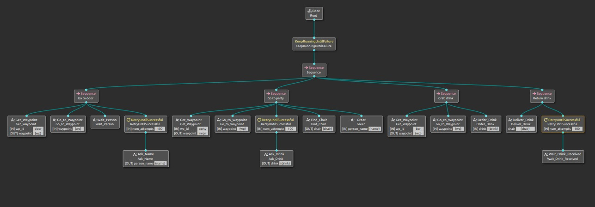

# Receptionist

En esta práctica, el robot debe realizar la prueba del recepcionista (página 59 del [Reglamento](https://athome.robocup.org/wp-content/uploads/2022_rulebook.pdf)), aunque algo descafeinado.

El robot tiene 10 minutos para lo siguiente:
1. El robot parte siempre de la posición inicial, que es justo detrás de la línea de al lado de la pizarra, como se indica en clase.
2. El robot va a la puerta, y cuando haya una persona (< 1.5 metros de la puerta), le pregunta su nombre, y le indica que le acompañe.
3. El robot va hacia la zona de la fiesta, le presenta, le pregunta qué quiere beber y le indica claramente (orientándose, por ejemplo) donde hay un hueco libre donde se puede sentar.
4. El robot va a la barra y le pide al barman la bebida. Considera que ya la lleva cuando el barman le dice "Aquí tienes", o algo similar.
5. El robot va a la persona y "le entrega" la bebida.
6. Goto 2

Puntuación:
* +5 Navegar hasta la puerta
* +5 Detecta persona correctamente
* +5 Navega a la zona de la fiesta
* +5 Le presenta con su nombre
* +5 Le indica correctamente donde sentarse
* +5 Pedir la bebida
* +5 Servir la bebida

La nota total de la práctica será en función de los puntos: notas = puntos / 40.0
Habrá hasta dos puntos extra en la nota final por hacer un póster del equipo.

***

# Receptionist-Forocoches V.1.0.0

*LOGO*

¡Bienvenidos al repositorio de Receptionist-Forocoches! Somos un equipo altamente cualificado y dedicado que ha trabajado arduamente en este proyecto. Este es un modelo de sistema desarrollado en ROS-2 que permite a un robot navegar hasta varios puntos concretos utilizando mapas, además de poseer la capacidad de mantener un diálogo con el usuario mediante el uso de gb-dialog, y de reconocer tanto a personas como a sillas mediante la librería darknet-ros.

Este proyecto es el resultado de la conjunción de percepción, navegación mediante mapas y diálogo. Todas estas partes se han mejorado y perfeccionado para que el robot pueda, partiendo desde el punto inicial correcto y utilizando un mapa previamente creado, pueda navegar hacia varios puntos especificados, todo ello mientras va preguntando al usuario preguntas concretas como el nombre, su bebida favorita, e incluso la capacidad de ofrecerle sitio en un escenario que se ha representado como un bar.

*VÍDEO DEL KOBUKI EN MOVIMIENTO (LUNES)*

## Instalación

Este repositorio contiene todos los componentes necesarios para utilizar este modelo de sistema en tu propio robot. A continuación se detallan los pasos para facilitar todo lo posible la instalación y el uso de este paquete:

1. Construye el repositorio principal:

```sh
mkdir -p <workspace>/src
cd <workspace>/src
git clone https://github.com/<usuario>/<repositorio>.git
cd ..
colcon build --symlink-install
```

2. Instala el repositorio:

```sh
source ./install/setup.sh
```

3. Recuerda que es importante descargar de forma recursiva la dependencia de darknet y nav2, y una vez se haya descargado, se deben instalar dichos paquetes en la terminal que se esté utilizando.

Toda está información se puede encontrar de forma más amplia en: https://docs.ros.org/en/foxy/Tutorials/Beginner-Client-Libraries/Colcon-Tutorial.html

Una vez se haya instalado el repositorio, podrás poner en marcha tu robot y hacer que vaya navegando por los puntos especificados mientras le va haciendo preguntas al usuario en momentos concretos para que éste le responda de vuelta, además de poder reconocer a la persona cuando ésta llega a la puerta, o cuando una silla está vacía y el robot pueda ofrecerle sitio.

## Modo de uso

Para lanzar el paquete Receptionist-Forocoches en ROS-2, es necesitario utilizar 2 launchers. Un launcher llamado dependencies.launch.py, que incluye todas las dependencias que hay que lanzar; y otro llamado receptionist_forocoches.launch.py, en el cual se incluye el ejecutable completo del paquete y que puede lanzarse tantas veces como se solciite.

Además, es importante asegurarse de conectar los correspondientes paquetes de sincronización con el robot Kobuki para que el sistema puede recibir y enviar datos correctamente.

```sh
ros2 launch receptionist-forocoches dependencies.launch.py
ros2 launch receptionist-forocoches receptionist_forocoches.launch.py
```

## Comportamiento (Percepción)

El nodo Wait_Person es el nodo que se encarga de detectar a la persona que está esperando en la puerta, y una vez la haya detectado se dirija hacia el bar. Por otra parte, también tenemos el nodo Find_Chair, el cual, una vez el robot ha llegado al bar, busca una silla vacía para poder ofrecerle asiento a la persona, para posteriormente ir a por la bebida.

Estos nodo reciben mensajes de detección de una persona y de una silla, respectivamente, en 3D de la cámara mediante el uso del paquete perception_asr y utilizando la información de la transformación de la cámara con respecto al robot para calcular la posición de la persona y/o de la silla en el marco de referencia del robot.

Estos dos nodos heredan de la clase BT::ActionNodeBase y contiene una serie de métodos para el procesamiento de datos. El método de tick() es el que se ejecuta cuando el nodo es activado y su función es determinar si ha detectado una persona en el caso del nodo Wait_Person, o una silla en el caso del nodo Find_Chair. Si no se ha recibido una detección de una persona o de una silla recientemente devuelve estado de fallo.

## Comportamiento (Diálogo)

*PENDIENTE DE PRUEBA (LUNES)*

## Comportamiento (Behavior Tree)

El Behavior Tree implementado para dirigir el comportamiento del robot consta de 10 nodos, los correspondientes a la percepción (Wait_person y Find_Person), diálogo (Ask_Drink, Ask_Name, Greet, Order_Drink y Wait_Drink_Received) y navegación (Go_to_Waypoint, Get_Waypoint, Deliver_Drink).

El raíz del Behavior Tree da al nodo de control del tipo KeepRunningUntilFailure, que asegura que el árbol siga ejecutándose mientras no ocurra ningún fallo. A continuación se encuentra un nodo de control Sequence que, como su nombre indica, ejecuta cada una de sus tareas en secuencia.

Dentro de este primer nodo de control Sequence, podemos encontrar cuatro nodos del mismo tipo que éste, todos ellos con una estructura similar pero con algunas diferencias que permiten identificar en qué parte de la ejecución nos encontramos.

El primer nodo de control se encarga de, una vez el robot se encuentra en el punto de partida, coger un punto cercano a la puerta para que el robot vaya navegando hacia el mismo. Una vez ha llegado a la puerta, espera a que aparezca la persona para que pueda preguntarle el nombre, y el robot no pasa al siguiente nodo de control hasta que haya obtenido el nombre con éxito, utilizando para ello un nodo de control RetryUntilSuccessful.

Una vez sabe el nombre de la persona y de haberle dado la bienvenida, se dirige hacia el punto central del bar donde pregunta a la persona que bebida desea tomar, y una vez lo sepa busca una silla que no esté ocupada para ofrecerle sitio a la persona, previamente habiendo presentado a las demás personas que ya se encontraban allí.

Después de haber ofrecido asiento a la persona, el robot se dirige hacia la mesa del barman para pedirle la bebida que la persona le había pedido, y por último busca a la persona que le había pedido la bebida y se la ofrece, y una vez haya terminado esto, vuelve a repetir todo el proceso desde el principio.

Nodos Get_Waypoint, Go_to_Waypoint, Deliver_Drink.



## Autores

* Javier Izquierdo
* Alberto León
* Luis Moreno
* Sebastian Mayorquín

## Contribuciones

Las contribuciones son bienvenidas. Si deseas contribuir a este proyecto, por favor, crea un pull request. Asegúrate de seguir las directrices de contribución antes de hacerlo.

__By Forocoches__

